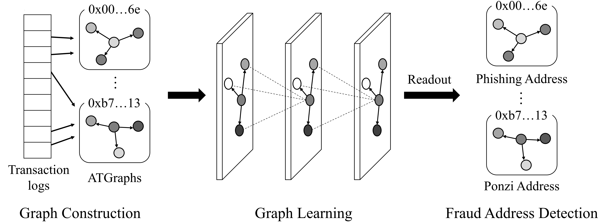
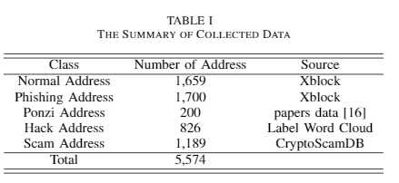

# FDGNN: Fraud Address Detection using Graph Neural Network on Ethereum

### Abstract

Blockchain is a distributed ledger technology that allows users to issue transactions anonymously. Cryptocurrency is the typical application where users can trade without a trusted third party, such as a bank, and Ethereum is one of the biggest cryptocurrency platforms. However, due to the anonymity of blockchain, transactions are difficult to track. Therefore, cryptocurrencies are exploited for cybercrimes such as Ponzi, scam, and phishing. Cybercrimes in Ethereum are on the rise and have become the main threat to the trading security of an Ethereum ecosystem. To prevent cybercrimes and protect the assets of users, we propose fraud address detection using a graph neural network on Ethereum. Furthermore, we propose a novel graph structure called ATGraph that represents blockchain transactions into graph structure for analyzing transactions. We conducted experiments to detect fraud addresses on real Ethereum transactions. The experimental results show that the proposed FDGNN achieved up to 0.24 higher f1-score than stateof- the-art methods.



### Requirements

The codebase is implemented in Python 3.9.7.
```

torch         1.10.0
dgl-cu111     0.7.2
scikit-learn  0.23.2
tqdm          4.50.2

```

### Dataset

We collect labeled Ethereum addresses from various sources, including normal, phishing, Ponzi, scam, and hack. We collect 1,660 verified phishing addresses and 1,700 normal addresses from [XBlock](https://xblock.pro/), one of the blockchain data platforms. We use a dataset collected in the paper that proposed Ponzi scheme Detection. The dataset includes 200 Ponzi addresses. We also choose 1,189 addresses providing scam from [CryptoScamDB](https://cryptoscamdb.org/scams/). The 826 addresses of hackers who attacked exchanges such as Upbit, Bitpoint, EtherDelta, and Lendf.me were collected from Label Word Cloud at [Etherscan](https://etherscan.io/). Then, we crawl transaction data for each address using the API provided by Etherscan according to the collected addresses. Table I shows a summary of the collected data.



